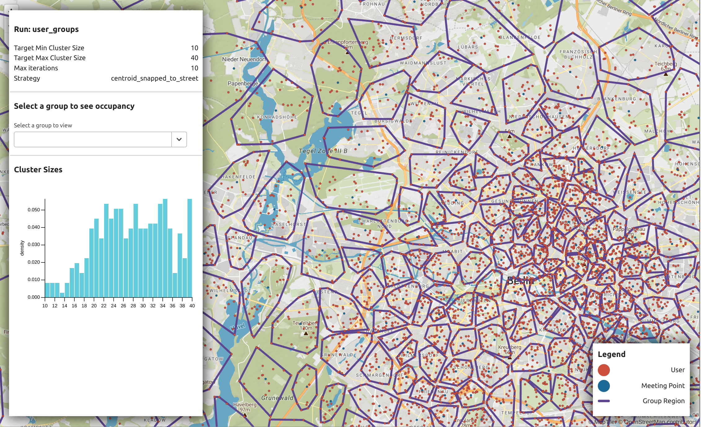

# Meetup

Meetup is a small command line utility aimed at generating groups of spatially close users who can go on shared adventures together.

- [Problem Statement](#problem_statement)
- [Approach](#approach)
- [Sample Output](#sample_output)
- [Installing Dependencies](#installing_dependencies)
- [Running Tests](#running_tests)
- [Running The Tool](#running_the_tool)
- [Visualising the results](#visualzing_the_results)



## Problem statement 

Given an input file containing a list of users, each with an id and a starting location, generate a number of groups and assign each 
user to one. Then generate a meeting point for each group and output the results in the format 

```csv
user_id, start_point_id, start_point_latitude, start_point_longitude, potential_group_members 
```

### Assumptions 

Though not stated in the initial problem statement I am making the following assumptions for this task 

1. Each user should be assigned to a group. No one should be left out 
2. The groups should be spatial compact, people should be matched with folks relatively close by 
3. The meeting point should be equally distant to most people in the group 
4. The meeting point should be somewhere on the street, for example it should not be in a lake or building.
5. We don't want groups to be too big as this might lead to huge numbers of people coming together for the activity 
6. We don't want groups to be too small as not everyone is going to show up so we dont want people to end up alone
7. The run time of the script doesn't matter too much. This is a task that will be run once and a while rather than all the time. So while we don't want it to take forever it is probably ok if it runs for a few minutes. 

## Approach 

### Cleaning the data 
I noticed in the data exploration phase that there are a number of users who have multiple entries in the input file each with a different starting location.
This seems to be a data issue, perhaps from the export of the data.

As we are treating these starting points as the locations where a user started their last activity (and so presumably close to where they live), we tidy the 
data up by assigning users with multiple entries a single starting point which is the centroid of all their entries in the input data.

There are also a number of starting points which are in non physical locations: lakes / buildings etc. I am going to assume that these are just issues with 
the synthetic data generation. If similar issues appeared in real data, we could attribute these to GPS error and fix them by snapping them to a known road network 
as we do with the meeting points (see later).

### Generating the Groups

Once the data is cleaned we need to generate the groups.

The approach we are going to take is one of a spatial clustering problem. We want to generate groups which 
are defined by the users assigned to them in such a way that they are all physically close to each other.

We don't necessarily know the number of groups that we want to generate. This will depend on the number of users in the file we are given.

For this reason (and because I have had good luck with this algorithm in the past for similar kinds of tasks), I choose to use AffinityPropagation 
to generate the initial clusters. This algorithm utilises message passing between groups to generate the clusters and has the following advantages 

1. It does not require us to specify how many clusters we are looking for 
2. It doesn't require us to select any initial cluster specifications (like initial centres in KMeans)
3. It does note make assumptions about the clusters shapes. It let's the data decide 

Running the AffinityPropagation algorithm gives us an initial set of clusters but it does not allow us to control 
for a minimum or maximum group occupation.

To take this into account we perform an iterative process of trying to improve the clusters. We cycle through the following 
steps 

1. Split groups which are larger than the maximum occupancy into n smaller clusters (where n is the ceiling of the groups size / max occupancy).
This is done by performing a KMeans clustering step on the members of the group 
2. Merge together groups which have less than the minimum group size. This is done by finding the 4 nearest groups to this one and merging it 
with the one which is smallest

These two steps are repeated until all groups are within the specified size limits or we reach some threshold.

### Generating a meeting point for each group

To generate a meeting point for each group, we have two options. 

1. Take the centroid of the group to pick a point which is pretty close for everyone. This has the potential downside 
that the meeting location might be a non physically accessible location(inside a building or lake etc).
2. Generate the centroid as in step 1 but snap that centroid to the road network to ensure that it's in an accessible place.

We leave this up to the user to decide which approach to take. The second approach will automatically download the street network 
from OpenStreeMap which can take some time.

### Caching 

The person creating the mailing list might want to play around with the settings the tool exposes, for example tweaking the min and max.
There are two steps which can be a little slow in the process

1. Generating the initial clusters 
2. Getting the road network from OSM if we are using the snap to street meetup point method 

Both of these are cached to allow quick reruns of the algorithm. If you need to clean the cache for a run 
though you can do so as follows 

```bash
poetry run python -m meetup clean {groupName}
```

### Thoughts on this approach 

There are a few downsides to the approach taken here. 

1. There is no guarantee that we will be able to make the min / max cluster targets. Sometimes the geometry of the problem will make this 
fairly impossible. 
2. We are trying to create compact clusters where each person is relatively close to the meeting point so as not to add a huge additional ride to their starting point.
On the outskirts of the city where the density of users falls off it can be hard to ensure this and the clusters get pretty big. I not sure there is a great way to 
generate physically smaller groups while keeping group occupancies high enough that it's likely that a user will be able to find people to join them for the activity.
3. Currently the clustering method uses euclidean distances to perform the clustering. In reality we should be using distances across the road network as this is the distance 
which users will actually have to travel. For 9000 users calculating their distance from each other across the network can get computationally expensive fast. There might be 
a way to do this though where we set a euclidean threshold and only calculate road network distances for pairs within that threshold and assign pairs which are outside that 
threshold an arbitrary large distance to disqualify them in the clustering algorithm. 
4. While we can snap the meeting points to the grid

### Areas for improvement 
Some ways I would love to improve the solution if given more time 

1. Find a way to use the OSM bike transit distances in the clustering algorithm instead of euclidean distances 
2. Add a third meetup location assignment strategy which looks for landmarks near the centroid of each group to use as the meetup point. This 
could be done using a POI database or something like the OSM Overpass API. It would give users something a bit more concrete than a lat lng pair 
to meet at.
3. It would be great to flesh out the visualisation tool a little more to allow a user to manually split and join groups together. As good as clustering can be, there is no substitute for human knowledge and intuition. 


## Sample output 

Included in this repo is the [berlin\_groups](berlin_groups) folder which contains the output for the a run with the follow parameters 

```bash
poetry run python -m meetup run  data/tours.csv berlin_groups --max-occupancy=40 --min-occupancy=10 --meeting-point-method=centroid_snapped_to_street 
```

The file for the newsletter is in that folder here: [newsletter.csv](berlin_groups/newsletter.csv)

The results can also be viewed with the following command 

```bash
poetry run python -m meetup visualize berlin_groups
```

## Installing dependencies 
We are using [poetry](https://python-poetry.org/) for dependency management on this project. 
To install dependencies, make sure you have poetry installed and then run 

```bash
poetry install
```

Once you have done that you can run 

```bash
poetry shell
```

to active the environment in your shell. Alternatively prefix other commands with 

```bash
poetry run 
```

## Running tests 

We use pytest to run the tests on the project 

```bash
poetry run pytest

```

## Running the tool

The most basic way to run to run the tool is to simply pass it a file with the user starting locations
and id's and a run name. Meetup uses the run name to cache various stages of the computation to make it 
easy to tweak requirements. 

```bash
poetry run python -m meetup run user_file.csv berlin_groups
```

This will run the tool and output the results in a folder called berlin\_groups.

It will generate a number of files in there

- mailingList.csv : This is the output in the format requested by the challenge.
- groupMeetingPoint.geojson: A GeoJSON file of all of the meeting points for each group
- runDetails.json: A JSON file of the parameters used in this run
- groupRegions.geojson: A GeoJSON file of the catchment area for each group that has been generated
- userAssignments.geojson: A GeoJSON file of each user and the group they are assigned to.

The additional files are mainly for use in the visualisation command

### Additional Parameters 

The tool can also take in a number of additional parameters 

By default, the tool will try to determine from the data the ideal number of groups to be generated.
However if you want to have a minimum or maximum group size you can do so by using the following options:

- max\_occupancy: An optional parameter specifying the largest number of people in a group that we are comfortable with. The tool will try to break apart groups which are larger than this size 
- min\_occupancy: An optional parameter specifying the smallest number of people in a group that we are comfortable with. The tool will try to merge small groups together.
- max\_optomization\_iterations: Because of the geometry of the problem, it might be hard to obtain these limits. The tool tries to reach them by iteratively breaking apart and merging clusters. This parameter tells the tool how many iterations to do before giving up

Also by default the tool assumes that the input file follows the column naming conventions of the example file. If you want you can change these with the following settings 

- user\_id\_col: Input file column to use for the user id  
- lat\_col: Input file column to use for the latitude column  
- lng\_col: Input file column to use for the longitude column  


Finally the tool has two strategies for generating meeting points for each group

- meeting\_point\_method=centroid : The default, simply calculate the centroid of each group,
- meeting\_point\_method=centroid\_snapped\_to\_street : This will take each centroid and snap it to the street network. Note this requires downloading a street network for the area which can take a while.

To see a list of all commands run 

 ```bash
poetry run -m meetup --help
 ```

To see a full list of parameters for the run command do 

```bash
poetry run -m meetup run --help
```


## Visualising the results 

If you would like to visualise the resulting groups and their statistics run 

```bash
poetry run python -m meetup visualise berlin_groups  
```

This will launch a browser and run a small interactive viewer of the results

### Developing the visualisation tool

The visualisation tool is already built in production mode and part of the python module. If you need to develop it more you can do so by 

1. Installing the javascript dependencies 
```bash

cd visualization
pnpm install 
```

2. Starting the visualisation for a group
```bash
poetry run python -m meetup visualise berlin_groups  
```

3. Run the dev server 
```bash
cd visualization
pnpm dev
```


Once development is done, run the following to build a production bundle and install it in the module 

```bash
cd visualization
pnpm build
```


